# Agentic Programming: Workflows
## From Plan to Orchestration

Jian Weng  
CEMSE, KAUST  
Week 5, Session 1

---

# Today's Agenda

1. What a workflow is
2. Program vs script vs workflow
3. Agent workflow baseline for implementation
4. Multi-plan strategy (A/B/C -> D)
5. Human, AI, and code separation
6. Assignment

---

# Why Workflow Matters

- We already have SDD, DDD, TDD
- The next challenge is execution reliability at scale
- A workflow turns principles into repeatable steps

```text
Principle -> Workflow -> Execution -> Review
```

Without workflows, every task starts from zero.

---

# What Is a Workflow?

- A workflow is a soft script for development
- It defines a sequence of steps, checkpoints, and expected outputs
- It is less rigid than a program, but more structured than free-form prompting

```text
Goal + Ordered Steps + Exit Criteria = Workflow
```

---

# Program vs Script vs Workflow

| Type | Main Purpose | Typical Form |
|------|---------------|--------------|
| Program | Execute strict logic | C/C++/Rust/Go |
| Script | Automate operations | Bash/Python/JS |
| Workflow | Coordinate reasoning + actions | Natural language + tool calls |

- Workflow is not replacing programs/scripts
- Workflow coordinates when and how to use them

---

# Workflow Resilience vs Code Rigidity

- AI executing a workflow can adapt when it meets unexpected states
- It can retry, switch tools, or re-plan the next step and continue
- A normal program runs on a fixed axiom/rule system
- If a case is not encoded in that system, it can only raise an error

```text
Workflow executor:
  observe -> decide -> act -> re-observe -> continue

Fixed code path:
  if case_A ...
  else if case_B ...
  else throw UnhandledError
```

---

# Example: Missing GitHub Label (1/2)

Task: a skill should add label `needs-triage` to issue `#42`.

```bash
gh issue edit 42 --add-label needs-triage
# error: label "needs-triage" does not exist
```

Script-only behavior:
- The command fails
- The process exits
- No recovery unless fallback logic was pre-coded

---

# Example: Missing GitHub Label (2/2)

AI workflow behavior:

```text
1) Run command
2) Parse error log: missing label
3) Create label
4) Retry original command
```

```bash
gh label create needs-triage --color FFCC00 --description "Issue needs triage"
gh issue edit 42 --add-label needs-triage
```

AI updates environment state, then continues execution.

---

# Baseline Agent Workflow

For a feature implementation task:

1. Understand the task goal
2. Read the codebase and locate relevant units
3. Update interface documentation
4. Design or update test cases
5. Implement until tests pass

This keeps us aligned with DDD -> TDD -> Code.

---

# Multi-Plan Strategy

Generate multiple plans from different perspectives:

- Plan A: balanced implementation
- Plan B: more aggressive refactoring
- Plan C: more conservative refactoring
- Plan D: synthesize A/B/C into one final plan

```text
Same context -> A/B/C alternatives -> D synthesis
```

---

# Key Findings from Practice

1. Codebase reading is intelligence-heavy
2. The understanding output can be shared across A/B/C
3. Combining A/B/C into D is mostly orchestration
4. Final synthesis still needs intelligence

Implication: centralize understanding, diversify planning.

---

# Where Context Is Most Shared



Design around this shared context first.

---

# Can LLMs Execute Workflows Reliably?

- Some coding agents follow natural-language workflows better than others
- In this course, we focus on agents that can:
  - Keep plan structure across iterations
  - Execute step-by-step without losing order
  - Report progress and blockers clearly

Execution quality is a tool capability, not only a model capability.

---

# Separation of Responsibilities

**Human**
- Define intent and constraints
- Review plans and outcomes

**AI Agent**
- Generate plans
- Execute plans with tools

**Code/Infra**
- Coordinate multi-step execution
- Schedule, monitor, and recover tasks

---

# Human-AI-Code Coordination Loop

Goal 0: less manual intervention, higher reliability.
Goal 1: fewer tokens, less time to wait

Why is LLM so slow? How long do you wait for each iteration?

---

# More on LLM Inference

- Q: What does Llama-3-8B mean?
  - 8B parameters
- Q: How large is 8B parameters?
  - fp16: 2-bytes per parameter -> 16GB model size
  - int8: 1-byte per parameter -> 8GB model size
- Q: How much is a H-class GPU memory bandwidth?
  - 4TB/s
- Q: How many tokens can we process per second?
  - 4TB / 8GB = 500 toks/s (theoretical max)

---

# More on LLM Inference

- Reality: DeepSeek 3.2 is 671B parameters, which is even more complicated
  - 257 experts, do you even know what is MoE?
    - 8-top and 1 common expoert are activated per token
  - 2% of the weights are common: QKV projection

~35GB memory footprint per token, so 4TB / 35GB ≈ 120 toks/s (theoretical max)

---

# Practice it!

You do not need to submit an assignment for this session, but I strongly encourage you to do this to improve your life experience.

1. Write the code
2. Review the code for suggestions; if any, go back to 1
3. Simplify the code for suggestions; if any, go back to 1
4. Send pull request; if conflict, resolve the conflict and go back to 1
5. Wait until CI passes; if failed, fix the code and go back to 1