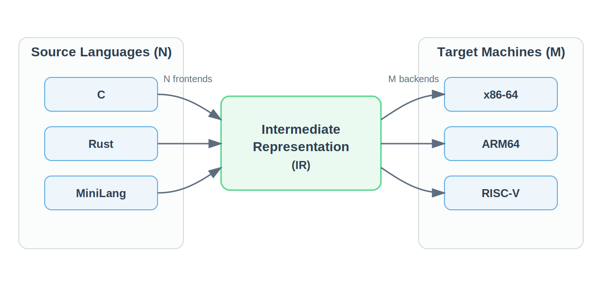

# Agentic Programming: Intermediate Representation
## CFG, Three-Address Code, and SSA

Jian Weng  
CEMSE, KAUST  
Week 9, Session 2

---

# Today's Agenda

1. Recap: IR as CFG from `w8d1`
2. Why compilers need a common IR
3. Why IR looks like CFG + three-address code
4. RISC-style intuition: operands and branch targets
5. SSA and why it makes optimization easier

---

# Recap from `w8d1`

Last time we introduced one half of IR:

- basic blocks
- branches
- loops
- merge points

That gave us **control flow**.

Today we add the other half:

- what each block computes
- how values move between definitions and uses

---

# Why We Need IR: The NxM Problem



- Without IR, `N` source languages and `M` targets need `N * M` direct compilers
- With IR, we build `N` frontends and `M` backends
- For this course: frontend -> IR -> machine code

---

# IR Is the Optimization Layer

- AST is close to source syntax
- Machine code is close to hardware constraints
- IR is the middle form where compilers analyze and transform programs

```text
source -> AST -> semantic check -> IR -> optimization -> codegen
```

This lets us do:

- machine-independent optimization on IR
- machine-specific instruction selection in the backend

---

# Why Does IR Look Like This?

For this course:

```text
IR = CFG + 3-address code
```

This is not arbitrary.

- machine instructions already expose explicit operands
- branches already expose explicit destinations
- IR keeps those two ideas, but removes hardware encoding details

---

# RISC-V Recap: What Assembly Looks Like

```text
add  t0, t1, t2      # t0 = t1 + t2
addi t0, t1, 4       # t0 = t1 + 4
beq  t0, zero, L1    # if t0 == 0 goto L1
j    L2              # goto L2
```

- arithmetic instruction: `dest`, `src1`, `src2/imm`
- branch instruction: condition + target label

This is exactly the intuition behind:

- **three-address code** for computation
- **control-flow graph** for branching structure

---

# Three-Address Code

A three-address instruction has at most three operands:

```text
dest = src1 op src2
dest = src1 op imm
dest = op src1
```

Example:

```text
t1 = a + b
t2 = t1 * 2
t3 = t2 < c
```

- temporaries make evaluation order explicit
- complex expressions become small, uniform steps

---

# CFG + TAC = Compiler-Friendly IR

```text
B0:
  t1 = a + b
  t2 = t1 * 2
  if t2 < 10 goto B1
  goto B2

B1:
  y = 1
  goto B3

B2:
  y = 0
  goto B3

B3:
```

- TAC explains computation inside blocks
- CFG explains where execution may go next

---

# Example: Lowering `if / else`

<div class="columns">
<div class="col">

Source:

```rust
if a + b < 10 {
  y = 1;
} else {
  y = 0;
}
```

</div>
<div class="col">

IR:

```text
B0:
  t1 = a + b
  t2 = t1 < 10
  if t2 goto B1
  goto B2
B1:
  y = 1
  goto B3
B2:
  y = 0
  goto B3
B3:
```

</div>
</div>

Source syntax is nested.
IR makes both value flow and control flow explicit.

---

# Functional Languages Give Good Intuition

Think about languages such as:

- Haskell
- OCaml
- F#

Their philosophy is roughly:

- define values, do not mutate them
- computation creates new values instead of overwriting old ones
- later expressions refer to earlier definitions

---

# Functional Languages Give Good Intuition (CONT'D)

In the simplified mental model for today:

- only defines
- no in-place update
- no "same variable, new content" style reasoning

That is very close to the value model behind SSA.

---

# This Is Different from C++-Style Programming

In an imperative language, one variable name often stands for
one mutable storage location.

```cpp
int x = a + b;
x = x * 2;
```

At source level, this feels natural:

- first `x` stores one value
- later `x` is updated in place
- the old content is overwritten

For humans, this is convenient.
For compiler analysis, this means one name does **not** denote one stable value.

---

# Direct Consequence: No `sum += a[i]`

In C++-style code, accumulation usually looks like this:

```cpp
int sum = 0;
for (int i = 0; i < n; ++i) {
  sum += a[i];
}
```

This relies on mutation:

- `sum` is updated in place
- the same storage slot is overwritten again and again

---

In a functional style, that is not the preferred description.
Instead, we describe accumulation as a fold over a list:

```text
foldl(+, 0, a)
foldr(+, 0, a)
```

So the program is expressed as:

- start from an initial value
- combine one element at a time
- produce a new value at each step

That is much closer to the define-once value model.

---

# Why Imperative Code Still Lowers to SSA

Even if the source language is not functional,
the compiler still prefers to lower it into a define-once form.

Source view:

```text
x = a + b
x = x * 2
```

---

# SSA (CONT'D)

SSA-like IR view:

```text
x1 = a + b
x2 = x1 * 2
```

So SSA is a way to recover this idea:

- one definition
- one value version
- no silent overwrite

That cleaner value model is what makes optimization practical.

---

# SSA: Static Single Assignment

SSA means:

- each variable version is assigned exactly once
- every use refers to a unique earlier definition
- variable names stand for values, not mutable storage slots

SSA is usually built on top of CFG-based IR.

This makes optimizations easier:

- constant propagation
- dead code elimination
- value tracking across the program

---

# From Mutation to SSA

Imperative style:

```text
x = a + b
x = x * 2
```

SSA style:

```text
x1 = a + b
x2 = x1 * 2
```

- `x1` and `x2` are different value versions
- no assignment silently overwrites an older value

---

# Why SSA Helps

Without SSA, the compiler must ask:

- which definition of `x` reaches this use?
- was `x` overwritten on another path?

With SSA, def-use chains are much cleaner:

```text
x1 = 3
x2 = x1 + 4
x3 = x2 * 0
```

Now it is much easier to reason about constants and dead definitions.

---

# CFG Meets SSA at Merge Points

Straight-line code is easy.
Branches introduce one extra idea:

```text
B1: x1 = 1
B2: x2 = 2
B3: x3 = phi(x1, x2)
```

- `x3` means: choose the incoming value based on the predecessor block
- this is how SSA connects value versions back to CFG merges

We will return to `phi` nodes when the IR becomes richer.

---

# Takeaways

- IR reduces the `N * M` compiler explosion into `N + M`
- For this course, IR is best viewed as `CFG + 3-address code`
- The shape of IR comes from machine instructions and explicit branch targets
- SSA renames assignments into value versions
- SSA makes optimization and analysis much easier
