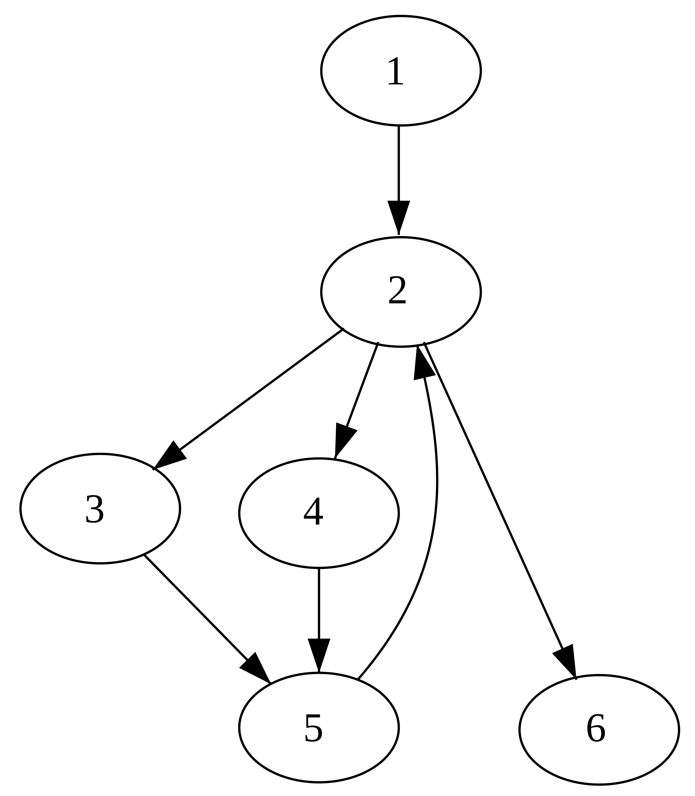
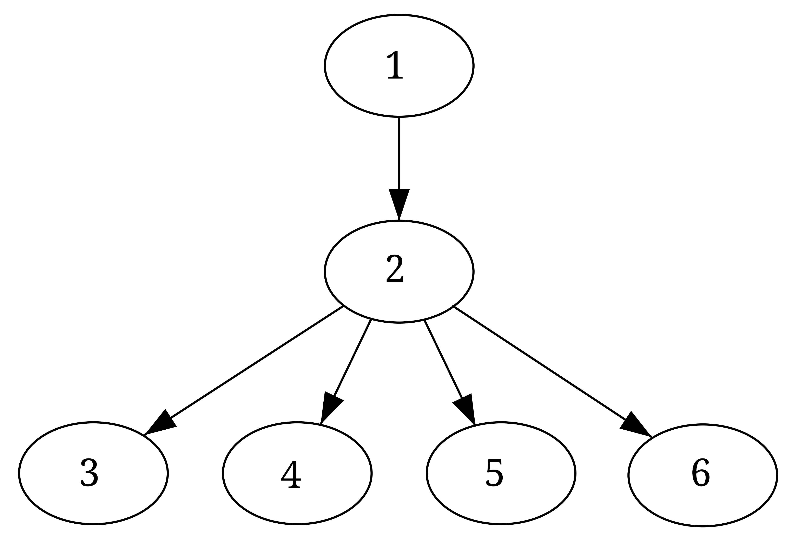

# Agentic Programming: SSA IR II
## Dominance, Phi, and Building IR

Jian Weng  
CEMSE, KAUST  
Week 10, Session 2

---

# Today's Agenda

1. Recap: SSA value versions from `w10d1`
2. Why merge points require `phi`
3. Dominance and dominance frontier
4. How SSA form is actually constructed
5. How LLVM gets SSA from stack slots
6. How to build CFG + `phi` with `IRBuilder`

---

# Recap from `w10d1`

Last time we moved from mutation to value versions:

```text
x = a + b
x = x * 2
```

became:

```text
x1 = a + b
x2 = x1 * 2
```

That works well for straight-line code.
The next problem is: what happens at a merge point?

---

# Why Merge Points Need `phi`

Source idea:

```rust
if x > 0 {
  y = 1;
} else {
  y = 2;
}
```

SSA-like IR:

```text
B1: y1 = 1
B2: y2 = 2
B3: y3 = phi([y1, B1], [y2, B2])
```

At `B3`, the compiler needs one name for "the value of `y` after the branch".

---

# What a `phi` Node Means

`phi` is a virtual instruction at the top of a block:

```text
v = phi([v1, Pred1], [v2, Pred2], ...)
```

Meaning:

- if control arrived from `Pred1`, choose `v1`
- if control arrived from `Pred2`, choose `v2`
- selection depends on the incoming CFG edge, not on a runtime compare here

---

# A Small CFG View

```text
        B0
      /    \
     v      v
    B1      B2
     \      /
      v    v
        B3
```

Example:

- `B1` defines `y1`
- `B2` defines `y2`
- `B3` is where both definitions may reach

That is exactly where `phi` becomes necessary.

---

# Dominance

Though trivial, we should have a source block.
In a program CFG, it is the entry block.

In this case, you can regard `B0` as the source.

```text
        B0
      /    \
     v      v
    B1      B2
     \      /
      v    v
        B3
```

---

# Dominance (CONT'D)

Block `A` dominates block `B` if **every path** from entry to `B`
must pass through `A`.

In the diamond CFG:

- `B0` dominates `B1`
- `B0` dominates `B2`
- `B0` dominates `B3`
- `B1` does **not** dominate `B3`
- `B2` does **not** dominate `B3`

Dominance tells us where a definition is definitely available.

---

# Dominance (CONT'D)

Immediate dominance can be represented as a tree.
Intuitively, yes. A dominates B, B dominates C, so A dominates C.

<div class="columns">
<div class="col" style="text-align: center;">

CFG



</div>
<div class="col" style="text-align: center;">

Dominator tree



</div>
</div>

---

# Why Dominance Matters for PHI

Block A dominates Block B means:

Block B can safely use values defined in Block A without worrying about divergence.

- Question: What if it does not dominate?
- Short answer: We should have it defined.
- Question: Where should it be defined?
- Short answer: this is not a short answer, but it is related to dominance frontier.

---

# Dominance Frontier

Frontier: the boarder of a country.
Dominance frontier: where A dominates B's predecessors, but does not dominates B itself.

```text
        B0
      /    \
     v      v
    B1      B2
     \      /
      v    v
        B3
```

---

# Dominance Frontier (CONT'D)

```text
        B0
      /    \
     v      v
    B1      B2
     \      /
      v    v
        B3
```

- B1 does not dominates B3, but B1 dominates one of B3's predecessors (B1 itself).
- Same for B2.
- Thus, values defined in B1 and B2 shall be converged at B3, which is exactly where the `phi` is.

---

# How `phi` Placement Works

For one variable `y`:

1. find blocks that assign to `y`
2. compute their dominance frontiers
3. place `phi` for `y` in those frontier blocks
4. repeat if a newly inserted `phi` creates another definition site

This is often described as using the **iterated dominance frontier**.

After `phi` placement, the compiler still needs one more step:

- rename values so each definition gets a unique version

---

# SSA Construction Is Two Problems

Problem 1: **where** should merged definitions appear?

- answered by dominance frontier

Problem 2: **what names** should each use refer to?

- answered by renaming along the dominance tree

So:

```text
phi placement + renaming = SSA form
```

This is why SSA is a graph problem, not just a text rewrite.

---

# How LLVM Usually Gets SSA

Frontend code often starts with mutable local variables as stack slots:

```llvm
%y = alloca i32
store i32 1, ptr %y
...
%v = load i32, ptr %y
```

Then LLVM promotes eligible local allocas into SSA registers:

- remove redundant `load` / `store`
- create SSA value versions
- insert `phi` where control-flow merges

For this course, think of this as:

```text
stack-style locals -> mem2reg -> SSA IR
```

---

# Before and After `mem2reg`

Before:

```text
entry: %y = alloca i32
then:  store 1, %y
else:  store 2, %y
merge: %v = load %y
```

After:

```text
then:  br label %merge
else:  br label %merge
merge: %v = phi i32 [1, %then], [2, %else]
```

This is much easier for later optimization passes to analyze.

---

# Building IR with `IRBuilder`

`IRBuilder` is LLVM's helper API for emitting IR incrementally.

Typical tasks:

- create basic blocks
- set insertion point
- emit arithmetic instructions
- emit `CreateCondBr` / `CreateBr`
- create `phi` nodes with `CreatePHI`
- fill incoming edges with `addIncoming`

It is not a new IR model.
It is the construction API for the IR model.

---

# Typical `if / else` Recipe

```cpp
auto *thenBB = BasicBlock::Create(ctx, "then", fn);
auto *elseBB = BasicBlock::Create(ctx, "else");
auto *mergeBB = BasicBlock::Create(ctx, "merge");

builder.CreateCondBr(cond, thenBB, elseBB);

builder.SetInsertPoint(thenBB);
Value *y1 = builder.getInt32(1);
builder.CreateBr(mergeBB);

fn->insert(fn->end(), elseBB);
builder.SetInsertPoint(elseBB);
Value *y2 = builder.getInt32(2);
builder.CreateBr(mergeBB);

fn->insert(fn->end(), mergeBB);
builder.SetInsertPoint(mergeBB);
auto *y = builder.CreatePHI(builder.getInt32Ty(), 2, "y");
y->addIncoming(y1, thenBB);
y->addIncoming(y2, elseBB);
```

This is the construction pattern you will use repeatedly.

---

# What You Should Build This Week

Your IR generator should be able to:

- create basic blocks for branch structure
- keep track of the current insertion block
- return the produced `Value *` for each expression
- create merge blocks explicitly
- create `phi` when an expression result can come from multiple predecessors

If LLM output already knows `IRBuilder`, good.
If not, add small helper skills and examples to anchor the pattern.

---

# Takeaways

- SSA is easy on straight-line code and interesting at merge points
- `phi` is the bridge between CFG structure and value versions
- dominance says where a path must go
- dominance frontier says where different definitions may need merging
- LLVM often reaches SSA by promoting stack slots with `mem2reg`
- `IRBuilder` is the practical API for constructing all of this
