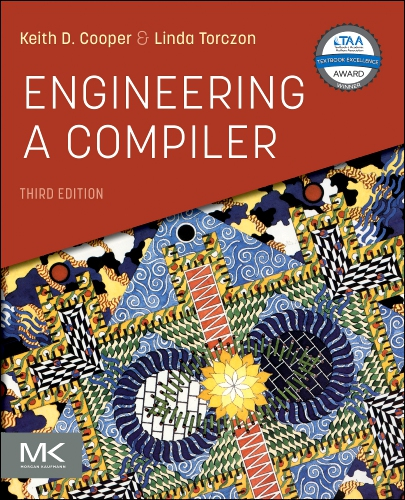
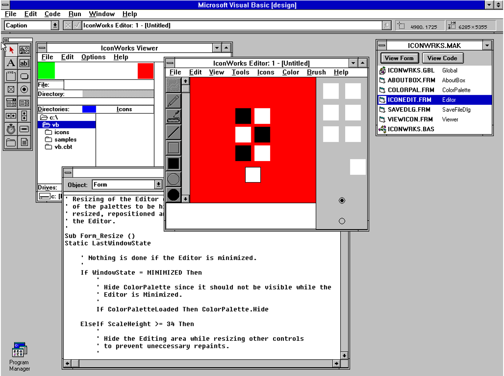
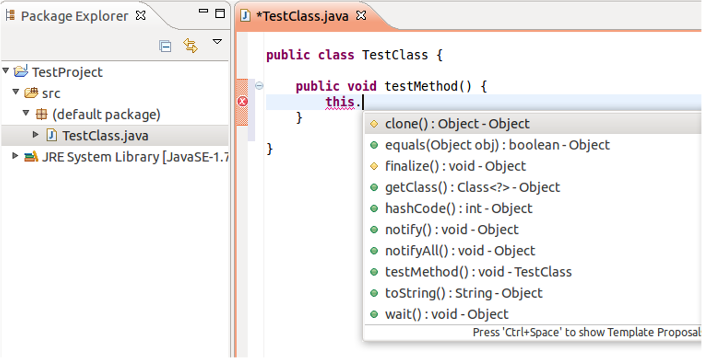

# Agentic Programming -
# A Compiler Case Study

### An Brief Intro to Agentic Programming

Jian Weng  
CEMSE, KAUST
Week-1 Session-1

---

# Agentic Programming for Compilation
# <del>(class renamed for 40-char limit in system)</del>

### An Brief Intro to Agentic Programming

Jian Weng  
CEMSE, KAUST
Week-1 Session-1

---

# Course Policy

- No attendance enforcement  
- It is **my duty** to keep the instruction important enough so that you all come  
- It is **your duty** to come to the class for learning  
- It is **your duty** to catch up after absence  

### AI / LLM Usage

- You **SHOULD** use them as much as possible — reliably  
- This class will teach you **how**  
- The load of this class is **UNACHIEVABLE** without their help  

---

# Goal: Writing a Compiler using AI Agents

- You will be an expert in:
  - **AI agent development**
  - **Compiler engineering**

  
  
  

---

# Why Compilers?

- Well-defined, well-studied project  
- Strong, intensive engineering effort  
- My hardest undergraduate class  
- My first experience managing:
  - Thousands of lines of code
  - A real system

---

# A History of Ergonomic Programming

- What do you use today?
  - IDE: VSCode? Cursor?
  - Command-line: Emacs? Vim?
- How do you write code?
  - Auto-completion?
  - Copilot? *tab tab tab*
- How do you run code?

> I loved command-line editors — seamless development & execution.

---

# Did you ever use one of these before?

---

# Punch the Tapes

  

---

# The 1st IDE (1971): Turbo Pascal

  

---

# Visual Basic (1991)

---

# Eclipse (2001)

---

# Copilot (2021)

---

# Syllabus

This class teaches how to:

- Use **AI agents** to efficiently develop & manage a project  
- Engineer a **compiler**

> First time teaching — content may evolve  
> Core focus remains unchanged

---

# This is **NOT** a class for vibe coding

  

---

# This is NOT a Class for “Vibe Coding”

- Do **not** abuse your feelings  
- If you do not know what you want:
  - Neither does AI
- AI is only as good as **you**
- AI agents are:
  - A *team of you*
  - For coding, documentation, and testing
- Heavy engineering can be done **all-in-one**

---

   </img>

- We are approaching this, but not 100% there yet.
---

# How is agentic programming architected?

**[Prompt]**
> Write a loop in C that sums up the given array and return the value.

**[CLI / Tools]**
- **Claude Code/Cursor/Codex**

**[Models]**

- Haiku (low; cheap); Sonnet (medium; capable); Opus (clever; expensive)

---

# How do we use it? (CONT’D)

I believe this what you do with AI agents, every day:

- Type in the prompt:

> I want something, please implement it for me.

- Wait for it is done...

- Run the code
  - It works! Great!
  - It fails! Start an infinite battle with prompts to debug
    - It works finally... It is still great?
    - It still fails... Start over with a new round of battles

---

# How do we use it? (CONT’D)

 </img>
- Is it really a good way of using AI agents?
- What is your key pain of using AI agents?

---

# Pain of using AI Agents - 1

- Did you remember in page 3?
  - Use AI agents as much as possible **in a reliable way**
- An honest question:
  - No matter who wrote it (either you or AI agent), how much courage do you need to run the code after writing?
- **Key pain**: Unreliable results
  - Illusion? (Bad font here.)
  - Buggy code?

---

# Lemma: Code is wrong until tested

- Agent is actually proactive, it will try to fix the code until it is correct.
- But how does it know the code is correct?
  - Write test cases!
  - Run test cases!
- Leave the pain of fixing bugs to the agent!
  - No worries, it won't complain!
  - It is your wallet to complain (maybe)
- What if the bug cannot be fixed? (Later on this)
  - Maybe as late as weeks later...

---

# Pain of using AI Agents - 2

- Pre-AI era: I want to start a new project
  - but where are the project templates?
- AI-agent era: I need to start from somewhere,
  - but from where?
- **Key pain**: Setting up the context
  - Which file should we hack to implement it?
  - How to run the test cases to verify the change?
  - Further, project-wise, does the implementation make sense?
---

# Wrong Solution: Let AI Agent to figure it out

Prompt:
> Read the codebase to understand the project and find where to implement the new feature X and have tests implemented and run to verify the implementation.

- Too long context to read
- Too general to understand the goal
- 👉🏻 Bad effects of achieving the goal
  - Hard to understand the goal
  - Fails to find the right files

---

# Diverge a little bit...

Do you know how an LLM works?
- Transformers, attention mechanism, tokens, embeddings, etc.
- $T$: An input token.
- $Q:=W_QT, K:=W_KT, V:=W_VT$: QKV linear projection.
  - Append the new $K$, $V$ to a stateful memory
- Attention: $\text{softmax}(\frac{QK^T}{\sqrt{d_k}})T$
- FFN Layer: Projections + Non-linear activation to generate new tokens to next transformer blocks.

---

# How LLM works (CONT’D)

We can see that
1. $K$, $V$ are the key to remember the context;
2. it is expensive to swap the whole model weight and;
3. KV-cache to synthesize a single new token to reflect a new context.

Predicting the next token is unreliable when context grows.
- Do not guess the context from scratch!
- Set up the context properly!

But I do not want to do it repeatedly 😭

---

# Setting up the contexts

- `CLAUDE.md` or `AGENTS.md` file
  - <del>Project overview</del>
  - How to setup the project
  - How to run the test cases
  - General design decisions and architecture of this project
> NOTE: These two files are the MOST precious files for your context
> Keep as important information there as possible!

---

# Chain of Thoughts (CoT)

- What was the really great thing of DeepSeek?
  - Low-cost training?
  - **An exposed chain of thought**
    - Damn it! The user is angry with me!

   </img>
   </img>

---

# Chain of Thoughts (CoT) (CONT’D)

- CoT helps answer quality by
  - Breaking down a complex problem into smaller steps
  - Letting the model reason through each step sequentially
- Setting up the context properly is like
  - A manually expanded CoT for the AI agent
  - **Key idea:** When you need help, be more specific to what you want!
    - If you do not know what you want, neither does the AI agent!