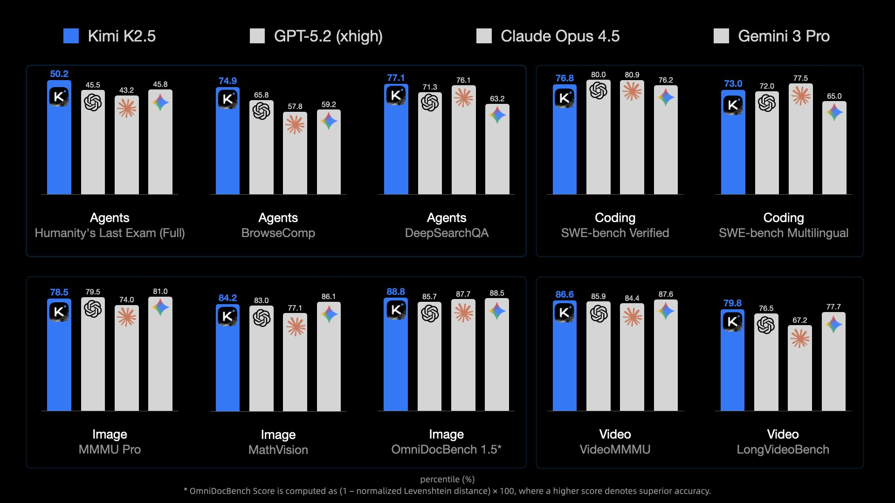

# Agentic Programming: Planning & Execution

Week 2, Session 2
Jian Weng
Computer Science, CEMSE
KAUST

---

# Sponsorship

I went to [moonshot.ai](https://moonshot.ai) for gift credits for this class.
Each of you can have $50 API usage for the experiments in the follow 6 months.

Try [Kimi Code](https://www.kimi.com/code) here - a great coding assistant CLI built on their SOTA mdoel Kimi K-2.5



---

## Recap from w2d1

- **SDD** — Spec/Standard-Driven Development
- **DDD** — Document-Driven Development
- **TDD** — Test-Driven Development

The standard: **Docs first, Tests second, Code last**

Today: How to **plan** and **execute** using this workflow

---

## Today's Topics

1. **Planning** — Using Plan Mode with few-shot learning
2. **Execution** — How to execute a plan iteratively
3. **Hands-on** — Building a Rust Lexer in C++

---

# Part 1: Plan Mode

---

## What is Plan Mode?

Claude Code/Cursor has a built-in **Plan Mode**:

```bash
claude
<Shift-Tab> twice to enter Plan Mode
```

Or trigger it with `/plan` in interactive mode.

**Plan Mode = AI generates the plan, you review it**

---

## Plan Mode Workflow


You don't write the plan — you **review** the plan.

---

## Two Checkpoints to Rollback

Like database transactions, Plan Mode gives you **two rollback points**:

```
Feature Request
     ↓
  ┌──────────────┐
  │  Plan Review │  ← Checkpoint 1: Reject bad plans early
  └──────┬───────┘
         ↓
   Execute on Branch
         ↓
  ┌──────────────┐
  │  PR Review   │  ← Checkpoint 2: Reject bad code before merge
  └──────┬───────┘
         ↓
   Merge to Main
```

**Two chances to say "no"** before anything hits main.

---

## Why We Need Plan Mode

Complex features can take **hours or days** to implement.

Without a plan:
- We **lose ourselves** in the lengthy process
- We accumulate **tons of uncommitted changes**
- We forget what we were trying to do
- The whole progress becomes **a mess**

A plan keeps us on track:
- Clear milestones to check off
- Smaller, reviewable commits
- Easy to pause and resume

---

## The Problem: AI Lacks the Mindset

Without guidance, AI jumps straight to **implementation**:

```
User: Add string literal support to the lexer

AI: Sure! Let me implement that...
    1. Modify lexer.cc to handle strings
    2. Done!
```

What's missing?
- **No documentation** — DDD ignored
- **No tests** — TDD ignored
- **No spec check** — SDD ignored

AI doesn't naturally think: **Docs → Tests → Code**

---

## The Solution: Few-Shot Learning

Teach the AI **how to plan** by giving examples.

**Few-shot learning** = show the AI examples of good output

Where to put these examples?
- `CLAUDE.md` — always loaded
- `.claude/commands/plan.md` — triggered by `/plan`
- `.claude/skills/planning/SKILL.md` — auto-triggered

---

## What Makes a Good Plan?

A good plan answers **three questions**:

1. **What files to READ?** — Understand current state
2. **What files to CHANGE?** — Know the scope
3. **How to TRANSLATE?** — From current → desired state

---

## Question 1: What to Read?

AI needs an **entry point** to understand the codebase.

In `CLAUDE.md`, tell AI where to start:

```markdown
## Project Architecture
See docs/architecture.md for the overall design.
Each module has its own README in docs/<module>.md
```

Then in `docs/architecture.md`:

```markdown
# Architecture
- src/lexer/  → Tokenization (see docs/lexer.md)
- src/parser/ → AST building (see docs/parser.md)
- src/codegen/ → Code generation (see docs/codegen.md)
```

**Give AI a map, not a maze.**

---

## Question 2: What to Change?

Write a **specific** feature request. Focus on **one thing at a time**.

**Bad:**
```
Build me a compiler
```

**Good:**
```
Create the lexer that tokenizes Rust source code.
Support: keywords, identifiers, numbers, strings, operators.
```

**Also good:**
```
Add string literal support to the lexer.
Handle escape sequences: \n, \t, \\, \"
```

**One feature → One plan → One PR**

---

## Question 3: How to Translate?

**You define the destination. AI finds the path.**

You provide:
- Entry point → `docs/architecture.md`
- Specific feature request → "Add string literals"

AI figures out:
- What files to read (from architecture)
- What files to change (from feature scope)
- How to translate current → desired

```
Human: Here's the map. Here's what I want.
AI:    Let me read, understand, and plan the changes.
```


---

## Example: AI-Generated Plan

With proper setup (architecture docs + few-shot examples), AI generates:

```markdown
## Plan: Add string literal support

### 1. Files Verified:
- docs/architecture.md — project structure
- docs/lexer.md — current token types
- src/lexer.cc — existing implementation

### 2. Files to be Changed:
- docs/lexer.md, src/token.h, tests/lexer_test.cc, src/lexer.cc

### 3. Steps of Implementation:
1. Update docs/lexer.md — document STRING token (DDD)
2. Add tests for string literals (TDD)
3. Add STRING to TokenType enum
4. Implement readString() in lexer.cc
```

**AI follows DDD → TDD → Code because we taught it to.**

---

## Plan Mode: The Review Step

**This is where human intervention is encouraged.**

Review carefully:
- Does the plan make sense?
- Does it follow DDD → TDD → Code?
- Are all files covered?

Take your time here. Ask questions. Request changes.

---

## After Approval: Fully Hands Off

Once you approve the plan:

**DO NOT intervene during execution.**

- Don't correct the AI mid-way
- Don't change requirements
- Don't nitpick variable names

Let AI **finish the plan** before any intervention.

```
Review ──> Approve ──> AI Executes ──> Done ──> Review Again
  ↑                      (NO TOUCH)               ↓
  └──────────────────────────────────────────────┘
```

Catching mistakes at planning is cheaper than at execution.

---

## Planning Summary

1. **Entry point** — `docs/architecture.md` as the map
2. **Specific request** — one feature at a time
3. **AI plans** — files verified, files to change, steps
4. **Review carefully** — this is your intervention point
5. **Then hands off** — let AI execute without interruption

---

# Part 2: Executing a Plan

---

## Stick to the Plan

Once approved, the goal is simple:

**Execute until all success criteria are met.**

```
while (!success_criteria) {
    state = look_at_current_state();
    success_criteria = execute_the_plan(plan, state);
}
```

No human intervention to interupt the loop.

---

## Tool: Ralph Loop

There's an official plugin for this execution pattern:

```
https://github.com/anthropics/claude-plugins-official
  └── plugins/ralph-loop
```

How it works:
1. Feed the plan as prompt
2. AI executes one iteration
3. Check success criteria
4. If not done: feed the plan + previous output back
5. Repeat until done

---

## Ralph Loop: The Idea

```
┌─────────────────────────────────────────────┐
│  Iteration 1:                               │
│  Input:  Plan                               │
│  Output: Partial implementation             │
├─────────────────────────────────────────────┤
│  Iteration 2:                               │
│  Input:  Plan + Output from Iteration 1     │
│  Output: More progress                      │
├─────────────────────────────────────────────┤
│  Iteration N:                               │
│  Input:  Plan + All previous outputs        │
│  Output: Done! All tests pass.              │
└─────────────────────────────────────────────┘
```

The plan stays constant. Context accumulates.

---

## Ralph Loop: The Problem

**It wastes tokens.**

Each iteration re-sends:
- The full plan
- All previous outputs
- Growing context window

```
Iteration 1:  1,000 tokens
Iteration 2:  3,000 tokens
Iteration 3:  6,000 tokens
Iteration 4: 10,000 tokens
...
```

For complex features, this gets expensive fast.

---

## Why No Human Intervention?

1. We already reviewed the plan carefully.
2. You can concurrently work on other tasks.

**Trust the process.** Let the models coordinate.

Human comes back when: **all tests pass** or **agent gives up**.
- What should we do when giving up?
- Incoperate the feedback into a new plan.

---

# Part 3: Hands-on Tutorial

## Building a Rust Lexer in C++

---

## What We're Building

A **lexer** (tokenizer) for a subset of Rust:

- Written in **C++**
- Tokenizes **Rust source code**
- Produces a stream of tokens

```rust
fn main() {
    let x = 42;
}
```
↓
```
[FN] [IDENT:main] [LPAREN] [RPAREN] [LBRACE]
[LET] [IDENT:x] [ASSIGN] [NUMBER:42] [SEMICOLON]
[RBRACE]
```

---

## Why C++ for a Rust Compiler?

1. **Learning exercise** — understand compiler internals
2. **No bootstrap problem** — don't need Rust to compile Rust
3. **Ecosystem** — C++ is standard for compiler dev
   - We have LLVM fully implemented in C++

Real-world Rust compiler (rustc) is written in Rust, but we start simple.

---

## Project Structure (DDD)

Following our DDD principles, we set up:

```
rust-compiler/
├── docs/
│   ├── architecture.md      ← Project overview
│   └── lexer.md             ← Lexer design doc
├── src/
│   ├── token.h              ← Token types
│   ├── lexer.h              ← Lexer interface
│   └── lexer.cc             ← Lexer implementation
├── tests/
│   └── lexer_test.cc        ← Lexer tests
├── CMakeLists.txt
└── CLAUDE.md
```

---

## First: Understand What We're Parsing

Before building a lexer, understand the **Rust syntax** we'll handle.

```rust
fn main() {
    let x = 42;
    let msg = "hello";
    if x > 0 {
        println!("{}", msg);
    }
}
```

What tokens do we see here?

---

## Rust Basics: Keywords

**Keywords** are reserved words with special meaning:

```rust
fn      // function declaration
let     // variable binding
mut     // mutable variable
if      // conditional
else    // alternative branch
while   // loop
return  // return from function
struct  // struct definition
```

These cannot be used as variable names.
Some language allows keywords as identifiers, but Rust does not.
E.g. in Python, `sum = 0` to override built-in `sum()`.

---

## Rust Basics: Identifiers & Literals

**Identifiers** — names for variables, functions, types:
```
main, x, msg, println, my_var, FooBar, _unused
```
Pattern: `[a-zA-Z_][a-zA-Z0-9_]*`
A combination of letters, digits, underscores; **cannot start with digit**.

**Number literals**:
```
42, 0, 1234, 3_141_592  // underscores allowed
```

**String literals**:
```
"hello", "world\n", "escaped \"quote\""
```

---

## Rust Basics: Operators & Punctuation

**Operators**:
```
+  -  *  /           // arithmetic
=                    // assignment
==  !=  <  >  <=  >= // comparison
->                   // return type arrow
```

**Punctuation**:
```
(  )    // function calls, grouping
{  }    // blocks
[  ]    // arrays
;       // statement terminator
:       // type annotation
,       // separator
```

---

## Step 2: Design the Interface

Keep it minimal. Three things:

```cpp
class Lexer {
public:
    Lexer(std::istream& input);  // file descriptor
    bool hasNext();              // more tokens?
    Token nextToken();           // get next token
};
```

That's it. **Let AI figure out the rest.**

- Token struct? AI decides.
- TokenType enum? AI decides.
- Internal helpers? AI decides.

You define **what**, AI implements **how**.

---

## What is a Lexer?

A **lexer** (tokenizer) converts source code into tokens.

```
Source:  "let x = 42;"

Lexer:   [LET] [IDENT:x] [ASSIGN] [NUMBER:42] [SEMICOLON]
```

Each token has:
- **Type** — what kind of token (keyword, number, operator)
- **Value** — the actual text ("x", "42")
- **Position** — line and column (for error messages)

---

## Understanding Regex for Lexers

Tokens are defined by **patterns**. Regex helps express them:

| Token Type | Pattern | Examples |
|------------|---------|----------|
| Identifier | `[a-zA-Z_][a-zA-Z0-9_]*` | `foo`, `_bar`, `x1` |
| Number | `[0-9]+` | `42`, `0`, `123` |
| String | `"[^"]*"` | `"hello"`, `""` |
| Keyword | `fn\|let\|if\|...` | `fn`, `let` |

The lexer tries patterns in order until one matches.

---

## Regex Basics

```
[a-z]     Match any lowercase letter
[A-Z]     Match any uppercase letter
[0-9]     Match any digit
[a-zA-Z]  Match any letter
_         Match underscore literally

+         One or more of the preceding
*         Zero or more of the preceding
?         Zero or one of the preceding

^         Start of string (or negation in [^...])
$         End of string
```

Example: `[a-zA-Z_][a-zA-Z0-9_]*` = identifier

---

## CMake Basics

**CMake** generates build files for your C++ project.

```cmake
# CMakeLists.txt
cmake_minimum_required(VERSION 3.10)
project(rust_compiler)

set(CMAKE_CXX_STANDARD 17)

# Build the compiler executable
add_executable(rustc
    src/main.cc
    src/lexer.cc
)
```

Build: `cmake -B build && cmake --build build`

---

## CMake: What We Deliver

Two things you can deliver to users:

**1. Executables** — standalone programs
```cmake
add_executable(rustc src/main.cc src/lexer.cc)
```

**2. Libraries + Headers** — for other projects to use
```cmake
add_library(lexer STATIC src/lexer.cc)
target_include_directories(lexer PUBLIC include/)
```

For this class: we build an **executable** compiler.

---

## CMake: Adding Tests

```cmake
# Enable testing
enable_testing()

# Build test executable
add_executable(test_lexer tests/test_lexer.cc src/lexer.cc)

# Register with CTest
add_test(NAME lexer_tests COMMAND test_lexer)
```

Run tests: `cd build && ctest`

---

## Preview: Recursive Descent Parser

After the lexer, we build a **parser**.

**Recursive descent** = each grammar rule becomes a function.

```
Grammar:
  expr   → term (('+' | '-') term)*
  term   → factor (('*' | '/') factor)*
  factor → NUMBER | '(' expr ')'
```

```cpp
Expr* parseExpr() { ... calls parseTerm() ... }
Expr* parseTerm() { ... calls parseFactor() ... }
Expr* parseFactor() { ... }
```

Each function returns an **AST node**.

---

## Parser: More Complex Than Lexer

Lexer is simple — describe in a few sentences.

Parser is complex — break into sub-tasks:

1. Parse **literals** (numbers, strings)
2. Parse **expressions** (binary ops, unary ops)
3. Parse **statements** (let, return, if)
4. Parse **functions** (fn declaration)
5. Connect everything into a **program**

**Bottom-up approach**: start simple, add complexity.

---

## Bottom-Up Parsing Strategy

```
Week 1: Literals only
        42, "hello", true

Week 2: Add binary expressions
        1 + 2, x * y

Week 3: Add statements
        let x = 1 + 2;

Week 4: Add functions
        fn foo() { return 42; }

Week 5: Full program
        fn main() { ... }
```

Each week builds on the previous. Tests grow incrementally.

---

# Assignment 1

---

## Assignment 1: Lexer

**Goal**: Implement a lexer for basic Rust syntax.

**Input**: Rust source file
**Output**: Stream of tokens

Must handle:
- Keywords: `fn`, `let`, `mut`, `if`, `else`, `while`, `return`
- Identifiers: `foo`, `_bar`, `x1`
- Numbers: `42`, `0`
- Strings: `"hello"`
- Operators: `+`, `-`, `*`, `/`, `=`, `==`, `!=`, `<`, `>`, `<=`, `>=`
- Punctuation: `(`, `)`, `{`, `}`, `;`, `:`, `,`

---

## Assignment 1: Deliverables

1. **Working lexer** — passes all provided tests
2. **CMakeLists.txt** — builds with `cmake`
3. **Your own tests** — at least 5 additional test cases

```bash
# Build
cmake -B build && cmake --build build

# Run tests
cd build && ctest

# Run on a file
./build/rustc input.rs
```

---

## Assignment 1: Tips

1. **Use Plan Mode** — let AI generate the implementation plan
2. **Start with keywords** — easiest to implement
3. **Add one token type at a time** — test as you go
4. **Handle edge cases**:
   - `fn_name` is IDENT, not FN
   - `==` is EQ, not two ASSIGNs
   - Whitespace and comments should be skipped

**Due**: Next week

---

## Questions?

